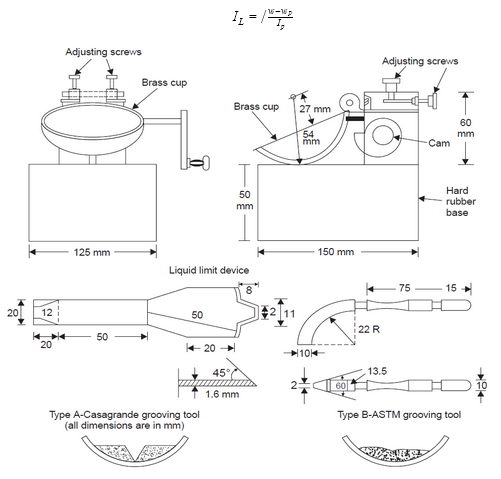

### INTRODUCTION 

<b>Liquid limit :</b> the liquid limit is the minimum moisture content at which the soil tends to flow like a liquid and which is, the arbitrary limit of the content of water at the point where the soil is just about to pass from the plastic state into the liquid state. At this state, the soil possesses a small value of shear strength, losing its ability to flow like a liquid.

 It is important to know the stress history and general properties of the soil met with construction. From the results of the liquid limit, the compression index may be estimated. The compression index value will help us in settlement analysis. Suppose the natural moisture content of the soil is closer to the liquid limit. In that case, the soil can be considered as soft if the moisture content is lesser than the liquids limit, the soil can be considered as soft if the moisture content is lesser than the liquid limit. The soil is brittle and stiffer.

<b>Liquidity index (IL) :</b> it is the ratio of the difference between the natural water content and the plastic limit to the plasticity index.

 

<b>Plastic limit :</b> is the water content where soil starts to exhibit plastic behavior. A thread of soil that is at its plastic limit when it is rolled to a diameter of 3 mm or begins to crumble. To improve consistency, a 3 mm diameter rod is often used to gauge the thread's thickness when conducting the test.

<b>Plasticity Index (IP) :</b>  It is the water content range within which the plastic properties of soil are exhibited; that is, it is the difference between liquid and plastic limits. 

IP = LL - PL

When the plastic limit cannot be determined, the material is non-plastic (NP). The plasticity index for sand is zero. For evaluating the plasticity properties of soil, it has been found desirable to use both the liquid limit and the plasticity index values. 
 

Soil can be classified based on the liquid limit as follows: 

<table style="text-align:center;">
<tr>
  <th>Liquid limit (%)</th>
  <th>Compressibility</th>
</tr>
<tr>
  <td> &lt; 35 </td>
  <td>Low</td>
</tr>
<tr>
  <td> 35 - 50 </td>
  <td>Intermediate</td>
</tr>
<tr>
  <td> &gt; 50 </td>
  <td>High</td>
</tr>
</table>

